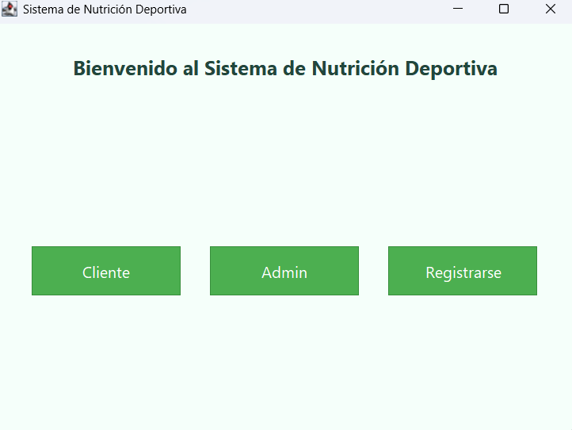
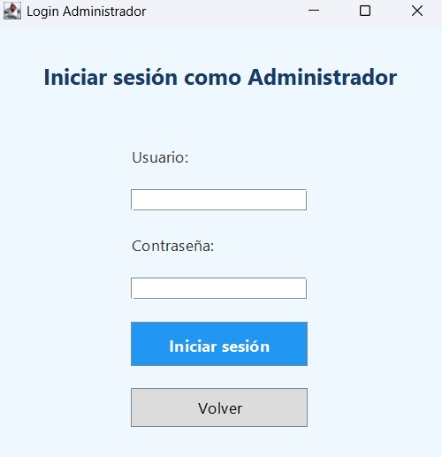
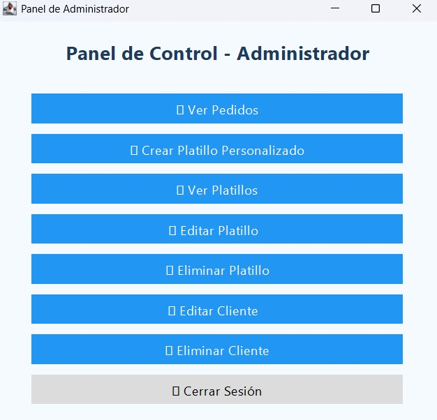
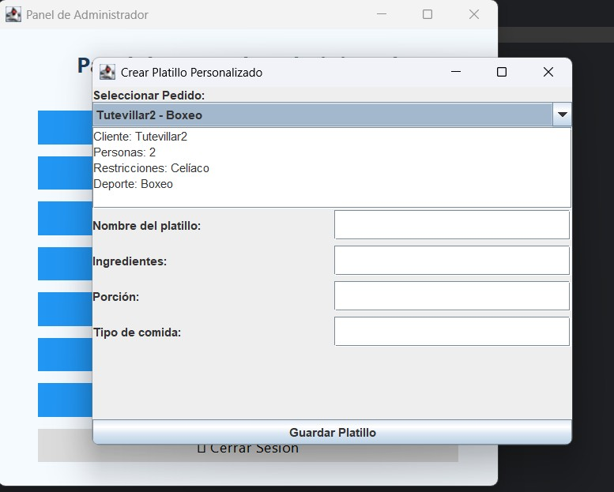
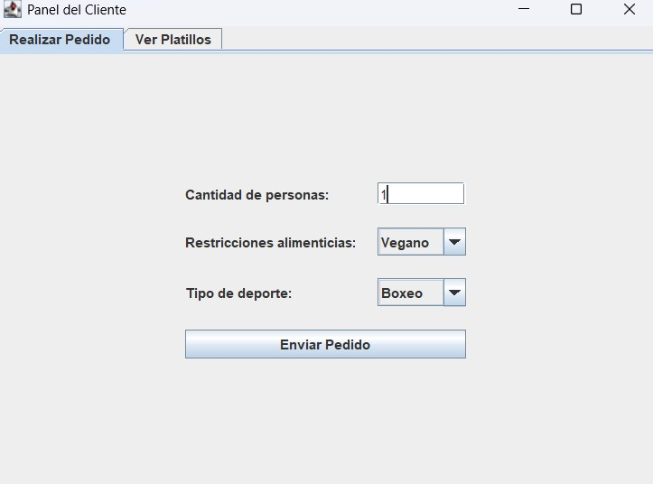
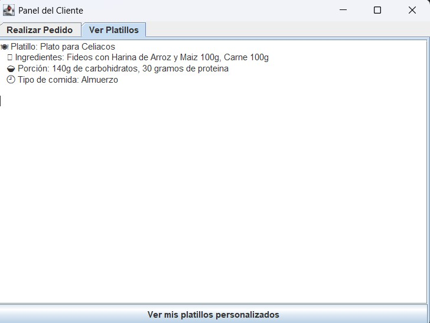

# Sistema de Nutrición Deportiva

Aplicación de escritorio desarrollada en Java utilizando Swing para la gestión de clientes, pedidos y platillos personalizados orientados a nutrición deportiva.

## Funcionalidades

- Registro e inicio de sesión de clientes.
- Inicio de sesión de administradores.
- Creación de platillos personalizados.
- Gestión de pedidos.
- Interfaz gráfica desarrollada con Java Swing.
- Persistencia de datos mediante MySQL.

## Capturas de Pantalla

### Pantalla de Inicio

### Login de Administrador

### Login de Cliente

### Panel de Administración

### Crear Platillo

### Registro de Cliente

### Panel de Cliente

### Ver Platillos Disponibles

## Tecnologías Utilizadas

- Java
- Java Swing
- MySQL
- JDBC
- Eclipse IDE

## Requisitos

- JDK 17 o superior (o la versión utilizada en el proyecto).
- Eclipse IDE.
- MySQL Server.
- MySQL Connector/J (driver JDBC).

## Estructura del Proyecto

- BLL: Entidades del negocio.
- DLL: Acceso a datos y controladores.
- GUI: Interfaces gráficas.
- repository: Utilidades auxiliares.
- img: Recursos gráficos.

## Autor

Santiago Ghiano

Proyecto académico desarrollado para prácticas de programación orientada a objetos, interfaces gráficas y acceso a bases de datos.
